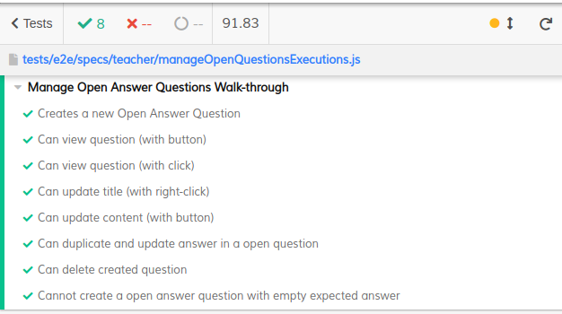
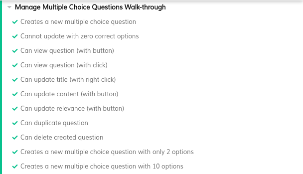
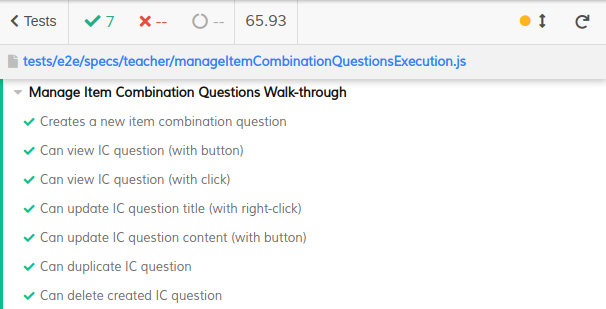

# ES21 P2 submission, Group 13

## Feature PRA

### Subgroup
<<<<<<< HEAD
 - António Venâncio, ist193689, Beatnancio
   + Issues assigned: [#54](https://github.com/tecnico-softeng/es21-g13/issues/54), [#56](https://github.com/tecnico-softeng/es21-g13/issues/56), [#58](https://github.com/tecnico-softeng/es21-g13/issues/58), [#62](https://github.com/tecnico-softeng/es21-g13/issues/62), [#64](https://github.com/tecnico-softeng/es21-g13/issues/64)
 - Aurora Nora, ist193573, Aurora2000
   + Issues assigned: [#54](https://github.com/tecnico-softeng/es21-g13/issues/54), [#56](https://github.com/tecnico-softeng/es21-g13/issues/56), [#58](https://github.com/tecnico-softeng/es21-g13/issues/58), [#62](https://github.com/tecnico-softeng/es21-g13/issues/62), [#64](https://github.com/tecnico-softeng/es21-g13/issues/64)

### Pull requests associated with this feature

The list of pull requests associated with this feature is:

 - [PR #059](https://github.com/tecnico-softeng/es21-g13/pull/59)
 - [PR #065](https://github.com/tecnico-softeng/es21-g13/pull/65)
 - [PR #066](https://github.com/tecnico-softeng/es21-g13/pull/66)

### Web services definition

#### Web services testing

 - [request the creation of an open answer type question](https://github.com/tecnico-softeng/es21-g13/blob/207dcbc4be4d955c7c55b07f8cc8f25ae69f787b/backend/src/test/groovy/pt/ulisboa/tecnico/socialsoftware/tutor/question/webservice/CreateQuestionWebServiceIT.groovy#L54)
 - [cannot request the creation of an open answer question with an empty answer](https://github.com/tecnico-softeng/es21-g13/blob/207dcbc4be4d955c7c55b07f8cc8f25ae69f787b/backend/src/test/groovy/pt/ulisboa/tecnico/socialsoftware/tutor/question/webservice/CreateQuestionWebServiceIT.groovy#L83)
 - [a student cannot create an open answer question](https://github.com/tecnico-softeng/es21-g13/blob/207dcbc4be4d955c7c55b07f8cc8f25ae69f787b/backend/src/test/groovy/pt/ulisboa/tecnico/socialsoftware/tutor/question/webservice/CreateQuestionWebServiceIT.groovy#L105)
 - [request the removal of an open answer type question](https://github.com/tecnico-softeng/es21-g13/blob/207dcbc4be4d955c7c55b07f8cc8f25ae69f787b/backend/src/test/groovy/pt/ulisboa/tecnico/socialsoftware/tutor/question/webservice/RemoveQuestionWebServiceIT.groovy#L45)
 - [request the export of an open answer type question](https://github.com/tecnico-softeng/es21-g13/blob/207dcbc4be4d955c7c55b07f8cc8f25ae69f787b/backend/src/test/groovy/pt/ulisboa/tecnico/socialsoftware/tutor/question/webservice/ExportQuestionWebServiceIT.groovy#L45)
 - [request the change of an open answer type question](https://github.com/tecnico-softeng/es21-g13/blob/207dcbc4be4d955c7c55b07f8cc8f25ae69f787b/backend/src/test/groovy/pt/ulisboa/tecnico/socialsoftware/tutor/question/webservice/UpdateQuestionWebServiceIT.groovy#L47)
 - [cannot update to a question with an empty answer](https://github.com/tecnico-softeng/es21-g13/blob/207dcbc4be4d955c7c55b07f8cc8f25ae69f787b/backend/src/test/groovy/pt/ulisboa/tecnico/socialsoftware/tutor/question/webservice/UpdateQuestionWebServiceIT.groovy#L86)
 
- [PR #096](https://github.com/tecnico-softeng/es21-g13/pull/96)
- [PR #101](https://github.com/tecnico-softeng/es21-g13/pull/101)

### Frontend

#### New/Updated Views

- [EditQuestionDialog](https://github.com/tecnico-softeng/es21-g13/blob/ce11cad3e108ff647eff1e40008f290fbad85d3a/frontend/src/views/teacher/questions/EditQuestionDialog.vue#L97)
- [ShowQuestion](https://github.com/tecnico-softeng/es21-g13/blob/ce11cad3e108ff647eff1e40008f290fbad85d3a/frontend/src/views/teacher/questions/ShowQuestion.vue#L32)

#### New/Updated Models

- [OpenQuestionView](https://github.com/tecnico-softeng/es21-g13/blob/develop/frontend/src/components/open-question/OpenQuestionView.vue)
- [OpenQuestionCreate](https://github.com/tecnico-softeng/es21-g13/blob/develop/frontend/src/components/open-question/OpenQuestionCreate.vue)

### End-to-end tests

#### Created tests

- [Creates a new Open Answer Question](https://github.com/tecnico-softeng/es21-g13/blob/ce11cad3e108ff647eff1e40008f290fbad85d3a/frontend/tests/e2e/specs/teacher/manageOpenQuestionsExecutions.js#L57)
- [Can update content (with button)](https://github.com/tecnico-softeng/es21-g13/blob/ce11cad3e108ff647eff1e40008f290fbad85d3a/frontend/tests/e2e/specs/teacher/manageOpenQuestionsExecutions.js#L155)
- [Can duplicate and update answer in a open question](https://github.com/tecnico-softeng/es21-g13/blob/ce11cad3e108ff647eff1e40008f290fbad85d3a/frontend/tests/e2e/specs/teacher/manageOpenQuestionsExecutions.js#L185)
- [Can delete created question](https://github.com/tecnico-softeng/es21-g13/blob/ce11cad3e108ff647eff1e40008f290fbad85d3a/frontend/tests/e2e/specs/teacher/manageOpenQuestionsExecutions.js#L227)
- [Cannot create a open answer question with empty expected answer](https://github.com/tecnico-softeng/es21-g13/blob/ce11cad3e108ff647eff1e40008f290fbad85d3a/frontend/tests/e2e/specs/teacher/manageOpenQuestionsExecutions.js#L238)

#### Commands defined

- [cleanOpenAnswerQuestionsByName](https://github.com/tecnico-softeng/es21-g13/blob/ce11cad3e108ff647eff1e40008f290fbad85d3a/frontend/tests/e2e/support/database.js#L142)

#### Screenshot of test results overview

---

## Feature PEM

### Subgroup

- Miguel Silva, ist193739, miguel-dasilva
   + Issues assigned: [#83](https://github.com/tecnico-softeng/es21-g13/issues/83), [#84](https://github.com/tecnico-softeng/es21-g13/issues/84),
[#93](https://github.com/tecnico-softeng/es21-g13/issues/93)
- Nuno Carvalho, ist193744, nfnvsc
   + Issues assigned: [#83](https://github.com/tecnico-softeng/es21-g13/issues/83), [#92](https://github.com/tecnico-softeng/es21-g13/issues/92),
[#93](https://github.com/tecnico-softeng/es21-g13/issues/93)

### Pull requests associated with this feature

The list of pull requests associated with this feature is:

- [PR #067](https://github.com/tecnico-softeng/es21-g13/pull/67)
- [PR #071](https://github.com/tecnico-softeng/es21-g13/pull/71)
- [PR #072](https://github.com/tecnico-softeng/es21-g13/pull/72)
- [PR #078](https://github.com/tecnico-softeng/es21-g13/pull/78)

### Web services definition

#### Web services testing

- [QuestionController.java](https://github.com/tecnico-softeng/es21-g13/blob/develop/backend/src/main/java/pt/ulisboa/tecnico/socialsoftware/tutor/question/api/QuestionController.java)

#### Web services tests

- [request the creation of a multiple choice question with 2 right answers and 1 wrong](https://github.com/tecnico-softeng/es21-g13/blob/develop/backend/src/test/groovy/pt/ulisboa/tecnico/socialsoftware/tutor/question/webservice/CreateQuestionWebServiceIT.groovy#L65)
- [cannot create multiple choice question with no right answers](https://github.com/tecnico-softeng/es21-g13/blob/develop/backend/src/test/groovy/pt/ulisboa/tecnico/socialsoftware/tutor/question/webservice/CreateQuestionWebServiceIT.groovy#L109)
- [a student cannot create a multiple choice question](https://github.com/tecnico-softeng/es21-g13/blob/develop/backend/src/test/groovy/pt/ulisboa/tecnico/socialsoftware/tutor/question/webservice/CreateQuestionWebServiceIT.groovy#L135)
- [cannot update question if not in the course](https://github.com/tecnico-softeng/es21-g13/blob/develop/backend/src/test/groovy/pt/ulisboa/tecnico/socialsoftware/tutor/question/webservice/UpdateQuestionWebServiceIT.groovy#L146)
- [request the update of a multiple choice answer type question](https://github.com/tecnico-softeng/es21-g13/blob/develop/backend/src/test/groovy/pt/ulisboa/tecnico/socialsoftware/tutor/question/webservice/UpdateQuestionWebServiceIT.groovy#L200)
- [cannot update MultipleChoiceQuestion with invalid options](https://github.com/tecnico-softeng/es21-g13/blob/develop/backend/src/test/groovy/pt/ulisboa/tecnico/socialsoftware/tutor/question/webservice/UpdateQuestionWebServiceIT.groovy#L256)
- [request the removal of a multiple choice question](https://github.com/tecnico-softeng/es21-g13/blob/develop/backend/src/test/groovy/pt/ulisboa/tecnico/socialsoftware/tutor/question/webservice/RemoveQuestionWebServiceIT.groovy#L76)
- [teacher cant remove an existing multiple choice question if not on the course](https://github.com/tecnico-softeng/es21-g13/blob/develop/backend/src/test/groovy/pt/ulisboa/tecnico/socialsoftware/tutor/question/webservice/RemoveQuestionWebServiceIT.groovy#L109)
- [request the export of a multiple choice answer type question](https://github.com/tecnico-softeng/es21-g13/blob/develop/backend/src/test/groovy/pt/ulisboa/tecnico/socialsoftware/tutor/question/webservice/ExportQuestionWebServiceIT.groovy#L100)
- [PR #094](https://github.com/tecnico-softeng/es21-g13/pull/94)
- [PR #095](https://github.com/tecnico-softeng/es21-g13/pull/95)
- [PR #194](https://github.com/tecnico-softeng/es21-g13/pull/104)

### Frontend

#### New/Updated Views

- [EditQuestionDialog](https://github.com/tecnico-softeng/es21-g13/blob/develop/frontend/src/views/teacher/questions/EditQuestionDialog.vue)
- [ShowQuestion](https://github.com/tecnico-softeng/es21-g13/blob/develop/frontend/src/views/teacher/questions/ShowQuestion.vue)

#### New/Updated Models

- [Option.ts](https://github.com/tecnico-softeng/es21-g13/blob/develop/frontend/src/models/management/Option.ts)

#### Updated Components

- [MultipleChoiceCreate](https://github.com/tecnico-softeng/es21-g13/blob/develop/frontend/src/components/multiple-choice/MultipleChoiceCreate.vue)

### End-to-end tests

#### Created tests

- [Creates a new multiple choice question](https://github.com/tecnico-softeng/es21-g13/blob/develop/frontend/tests/e2e/specs/teacher/manageMultipleChoiceQuestionsExecution.js#L70)
- [Cannot update with zero correct options](https://github.com/tecnico-softeng/es21-g13/blob/develop/frontend/tests/e2e/specs/teacher/manageMultipleChoiceQuestionsExecution.js#L118)
- [Can update relevance (with button)](https://github.com/tecnico-softeng/es21-g13/blob/develop/frontend/tests/e2e/specs/teacher/manageMultipleChoiceQuestionsExecution.js#L228)

#### Screenshot of test results overview

---

## Feature PCI

### Subgroup

- Francisco Rodrigues, ist193711, franciscosaiote
- Gustavo Pinto, ist189627, g2pinto
    + Issues assigned: [#81](https://github.com/tecnico-softeng/es21-g13/issues/81),            [#82](https://github.com/tecnico-softeng/es21-g13/issues/82), [#85](https://github.com/tecnico-softeng/es21-g13/issues/85), [#86](https://github.com/tecnico-softeng/es21-g13/issues/86),     [#91](https://github.com/tecnico-softeng/es21-g13/issues/91)

### Pull requests associated with this feature

The list of pull requests associated with this feature is:

- [PR #074](https://github.com/tecnico-softeng/es21-g13/pull/74)
- [PR #073](https://github.com/tecnico-softeng/es21-g13/pull/73)
- [PR #079](https://github.com/tecnico-softeng/es21-g13/pull/79)
- [PR #077](https://github.com/tecnico-softeng/es21-g13/pull/77)

### Web services definition

#### Web services testing

- [create one to one ratio IC question for course execution](https://github.com/tecnico-softeng/es21-g13/blob/b888158b28aea6af0e79b03402317201b49ef055/backend/src/test/groovy/pt/ulisboa/tecnico/socialsoftware/tutor/question/webservice/CreateQuestionWebServiceIT.groovy#L243)
- [teacher without permission cannot create IC question for course execution](https://github.com/tecnico-softeng/es21-g13/blob/b888158b28aea6af0e79b03402317201b49ef055/backend/src/test/groovy/pt/ulisboa/tecnico/socialsoftware/tutor/question/webservice/CreateQuestionWebServiceIT.groovy#L291)
- [remove ic question for a course execution](https://github.com/tecnico-softeng/es21-g13/blob/b888158b28aea6af0e79b03402317201b49ef055/backend/src/test/groovy/pt/ulisboa/tecnico/socialsoftware/tutor/question/webservice/RemoveQuestionWebServiceIT.groovy#L170)
- [no permission to remove ic question for a course execution](https://github.com/tecnico-softeng/es21-g13/blob/b888158b28aea6af0e79b03402317201b49ef055/backend/src/test/groovy/pt/ulisboa/tecnico/socialsoftware/tutor/question/webservice/RemoveQuestionWebServiceIT.groovy#L206)
- [request update to an IC question](https://github.com/tecnico-softeng/es21-g13/blob/b888158b28aea6af0e79b03402317201b49ef055/backend/src/test/groovy/pt/ulisboa/tecnico/socialsoftware/tutor/question/webservice/UpdateQuestionWebServiceIT.groovy#L168)
- [update ic question with the deletion of an item link](https://github.com/tecnico-softeng/es21-g13/blob/b888158b28aea6af0e79b03402317201b49ef055/backend/src/test/groovy/pt/ulisboa/tecnico/socialsoftware/tutor/question/webservice/UpdateQuestionWebServiceIT.groovy#L235)
- [update ic question with a new item link](https://github.com/tecnico-softeng/es21-g13/blob/b888158b28aea6af0e79b03402317201b49ef055/backend/src/test/groovy/pt/ulisboa/tecnico/socialsoftware/tutor/question/webservice/UpdateQuestionWebServiceIT.groovy#L302)
- [update ic question by changing item link](https://github.com/tecnico-softeng/es21-g13/blob/b888158b28aea6af0e79b03402317201b49ef055/backend/src/test/groovy/pt/ulisboa/tecnico/socialsoftware/tutor/question/webservice/UpdateQuestionWebServiceIT.groovy#L376)
- [student cannot update an IC question](https://github.com/tecnico-softeng/es21-g13/blob/b888158b28aea6af0e79b03402317201b49ef055/backend/src/test/groovy/pt/ulisboa/tecnico/socialsoftware/tutor/question/webservice/UpdateQuestionWebServiceIT.groovy#L449)
- [request to export an item combination question](https://github.com/tecnico-softeng/es21-g13/blob/b888158b28aea6af0e79b03402317201b49ef055/backend/src/test/groovy/pt/ulisboa/tecnico/socialsoftware/tutor/question/webservice/ExportQuestionWebServiceIT.groovy#L148)
- [student cannot export IC question](https://github.com/tecnico-softeng/es21-g13/blob/b888158b28aea6af0e79b03402317201b49ef055/backend/src/test/groovy/pt/ulisboa/tecnico/socialsoftware/tutor/question/webservice/ExportQuestionWebServiceIT.groovy#L191)

- [PR #090](https://github.com/tecnico-softeng/es21-g13/pull/90)
- [PR #097](https://github.com/tecnico-softeng/es21-g13/pull/97)
- [PR #099](https://github.com/tecnico-softeng/es21-g13/pull/99)
- [PR #100](https://github.com/tecnico-softeng/es21-g13/pull/100)
- [PR #102](https://github.com/tecnico-softeng/es21-g13/pull/102)

### Frontend

#### New/Updated Views

- [EditQuestionDialog](https://github.com/tecnico-softeng/es21-g13/blob/develop/frontend/src/views/teacher/questions/EditQuestionDialog.vue)
- [ShowQuestion](https://github.com/tecnico-softeng/es21-g13/blob/develop/frontend/src/views/teacher/questions/ShowQuestion.vue)

#### New/Updated Models

- [Item](https://github.com/tecnico-softeng/es21-g13/blob/develop/frontend/src/models/management/Item.ts)

### End-to-end tests

#### Created tests

- [Creates a new item combination question](https://github.com/tecnico-softeng/es21-g13/blob/3c15acdf2d0557a673e6d05fe64f4d49484744a0/frontend/tests/e2e/specs/teacher/manageItemCombinationQuestionsExecution.js#L57)
- [Can view IC question (with button)](https://github.com/tecnico-softeng/es21-g13/blob/3c15acdf2d0557a673e6d05fe64f4d49484744a0/frontend/tests/e2e/specs/teacher/manageItemCombinationQuestionsExecution.js#L113)
- [Can view IC question (with click)](https://github.com/tecnico-softeng/es21-g13/blob/3c15acdf2d0557a673e6d05fe64f4d49484744a0/frontend/tests/e2e/specs/teacher/manageItemCombinationQuestionsExecution.js#L129)
- [Can update IC question title (with right-click)](https://github.com/tecnico-softeng/es21-g13/blob/3c15acdf2d0557a673e6d05fe64f4d49484744a0/frontend/tests/e2e/specs/teacher/manageItemCombinationQuestionsExecution.js#L141)
- [Can update IC question content (with button)](https://github.com/tecnico-softeng/es21-g13/blob/3c15acdf2d0557a673e6d05fe64f4d49484744a0/frontend/tests/e2e/specs/teacher/manageItemCombinationQuestionsExecution.js#L172)
- [Can duplicate IC question](https://github.com/tecnico-softeng/es21-g13/blob/3c15acdf2d0557a673e6d05fe64f4d49484744a0/frontend/tests/e2e/specs/teacher/manageItemCombinationQuestionsExecution.js#L203)
- [Can delete created IC question](https://github.com/tecnico-softeng/es21-g13/blob/3c15acdf2d0557a673e6d05fe64f4d49484744a0/frontend/tests/e2e/specs/teacher/manageItemCombinationQuestionsExecution.js#L257)

#### Commponent defined

- [Item Combination Create](https://github.com/tecnico-softeng/es21-g13/blob/pci/frontend/src/components/item-combination/ItemCombinationCreate.vue)
- [Item Combbination View](https://github.com/tecnico-softeng/es21-g13/blob/pci/frontend/src/components/item-combination/ItemCombinationView.vue)

#### Commands defined

- [cleanItemCombinationQuestionsByName](https://github.com/tecnico-softeng/es21-g13/blob/d8512c47a497f7ea8e656cf60f63e99c8276ec4d/frontend/tests/e2e/support/database.js#L147)

#### Screenshot of test results overview

